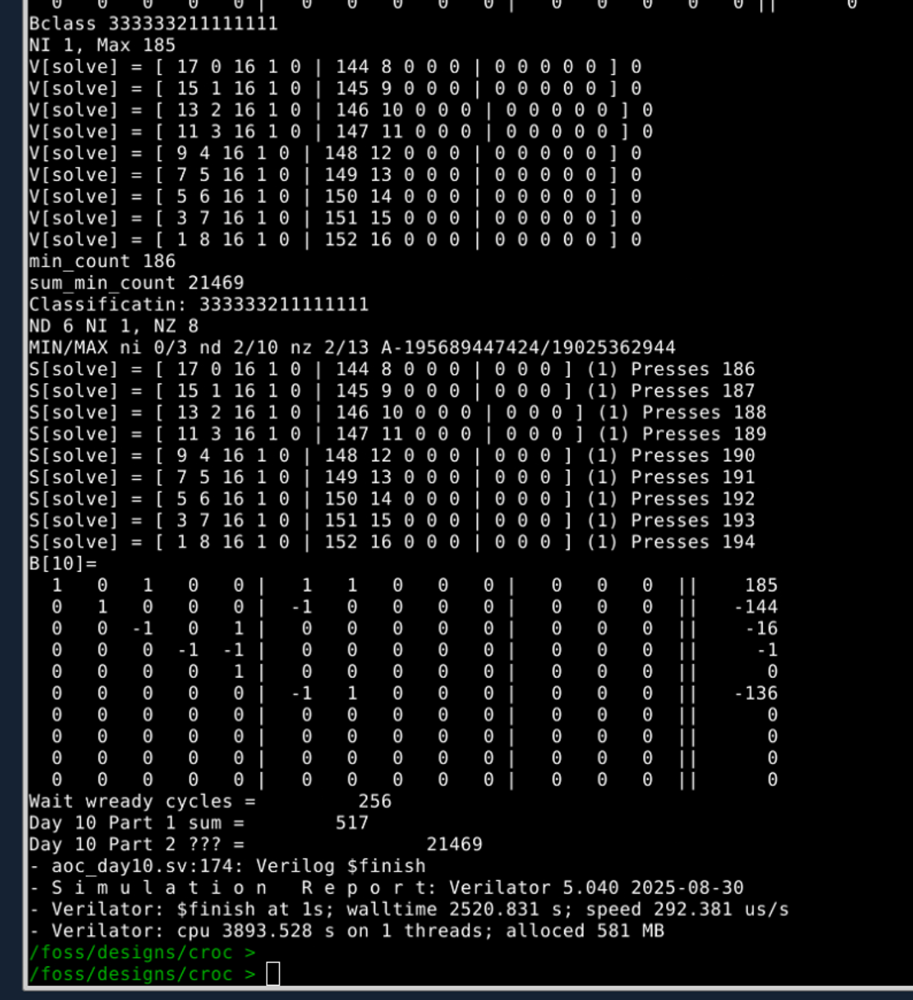

# AoC 2025 Day-10 puzzle solution generation in verilog.

## Part 1

This is a synthesizable verilog module to solve Day 10 part 1. Verilog seemed most straight forward to solve this using a large 16x10 XOR array to do the calculation
of the indicators vs buttons, and a counter to brute force each machines' solution., Eventually found my final typo and out popped the correct day 10 part 1 sum.

    aoc_day10.sv - Contains a verilog behavioral testbench and sythesizeable compute module
	day10_puzzle.txt - puzzle text
	day10_run.sh  - everything to run the verilator simulation

The behvioral code parses the puzzle text and writes the data into a port on the solve hardware with user classification depending upon the data type (lights,buttons,joltage)
The hardware shifts in the button data, and after the final joltage write full search on a range 2^buttons-1 to find cases where the XOR tree matches the desired lights, while keepding track of the lowest button presses for each match and after complation adding the number of presses to the sum.
	...
    Day 10 Part 1 sum =        517
    Day 10 Part 2 ??? =                  199
    - aoc_day10.sv:168: Verilog $finish
    - S i m u l a t i o n   R e p o r t: Verilator 5.040 2025-08-30
    - Verilator: $finish at 3ms; walltime 1.177 s; speed 1.584 ms/s
    - Verilator: cpu 1.706 s on 1 threads; alloced 579 MB

# Day 10 Part 2 Behavioral

Well, I solved it with behvaioral verilog with the following steps
    
	Forming the each puzzle line as a binary array concantenated with the desired joltages.
    Gaussian elimintation putting (13x10) array in eschelon order
	Walk through and classify the buttons as zero, dependant or independant
	walk through and generate the independant values (up to max joltage only)
	using back propagation solve for the dependant variables.
	Check that the solution has no negative or fracitonal button presses
	Count the number presses and keep track of the minimum over all solutions

In order to keep precision I didn't use reduced eschelon order, but this meant I would
get some very large integers, and in the end used 64-bit math. It was important that differences between
these large integers would result in relatively small integer solutions.

    EQN         216
      0   0   1   1   0 |   1   0   0   1   0 |   0   0   0   0   0 ||     51
      1   0   0   1   1 |   0   1   1   1   1 |   0   0   0   0   0 ||    219
      1   0   1   0   1 |   0   0   1   1   1 |   0   0   0   0   0 ||    199
      1   1   1   1   0 |   0   1   0   1   0 |   0   0   0   0   0 ||    197
      0   1   0   1   1 |   0   1   1   1   1 |   0   0   0   0   0 ||     90
      0   1   0   0   1 |   1   1   1   1   1 |   0   0   0   0   0 ||     83
      0   1   0   1   1 |   1   0   0   1   0 |   1   0   0   0   0 ||     89
      0   0   1   1   1 |   0   1   1   1   0 |   0   0   0   0   0 ||     79
      0   0   1   1   1 |   0   1   1   0   0 |   0   0   0   0   0 ||     61
      0   0   1   1   0 |   0   0   1   1   0 |   1   0   0   0   0 ||     67
    [11 X 10] Triangular Matrix
      1   1   1   1   0 |   0   1   0   1   0 |   0   0   0   0   0 ||    197
      0  -1  -1   0   1 |   0   0   1   0   1 |   0   0   0   0   0 ||     22
      0   0  -1   1   0 |   0   1   0   0   0 |   0   0   0   0   0 ||     20
      0   0   0  -2   0 |  -1  -1   0  -1   0 |   0   0   0   0   0 ||    -71
      0   0   0   0   2 |   0   0   2   1   2 |   0   0   0   0   0 ||     92
      0   0   0   0   0 |  -6  -2   0  -2   0 |   0   0   0   0   0 ||   -114
      0   0   0   0   0 |   0  16  12   4  12 | -12   0   0   0   0 ||    240
      0   0   0   0   0 |   0   0 384 192 768 | -384   0   0   0   0 ||   7296
      0   0   0   0   0 |   0   0   0 147456   0 |   0   0   0   0   0 ||  2654208
      0   0   0   0   0 |   0   0   0   0 19025362944 | -21743271936   0   0   0   0 ||  -195689447424
    Bclass 333333333321111
    NI 1, Max 219
    V[solve] = [ 142 13 2 19 18 | 12 3 19 18 0 | 9 0 0 0 0 ] 0
    V[solve] = [ 138 9 6 17 19 | 10 9 10 18 8 | 16 0 0 0 0 ] 0
    V[solve] = [ 134 5 10 15 20 | 8 15 1 18 16 | 23 0 0 0 0 ] 0
    min_count 255

# Day 10 Part 2 - Synthesizable system verilog

I took it as a my challenge to build 2 sythesizable combinatorial blocks to 1) perform gaussian elimination on the 14x10 input array [A|b], and 
2) solve Ax=b using bac propagation. 

      logic [9:0][8:0] joltage;
      logic [9: 0][12:0] buttons;
      logic signed [9:0][13:0][63:0] E; // Eschelon format array
      gauss_13x10 i_gauss( // Gaussian elimination of [A|b] down to eschelon form
                .a_in   ( buttons ),
                .b_in   ( joltage ),
                .E      ( E       )
        );

	   logic [1:0] num_ind; // number of independant variables (from solver )
       logic [2:0][8:0] ind;
       logic [12:0][8:0] V;  // Resultant soluiton vector (positive integers)
       solve_13x10 i_solve( // Solve for x, in eqn Ax=b, with up to 3 independant inputs
                .S      ( E       ), // The solution matrix input [A|b] in eschelon format
                .x_out  ( V       ), // Solution vector of button presses
                .x_sum  ( presses ), // Sum of button presses within output vector
                .posint ( val_sol ), // Flag is all positive integers
                .nind   ( num_ind ), // ouput of number in independant variables as input to sweep
                .ind    ( ind     ), // independant inputs, bound search based limit based on max joltage
       );
 
Using these blocks and sweeping the independant variables gives the Day 2 results. It took a bit of optimization for verilator to run efficienty, even so it took about 40 minutes to simulate the full day 10 puzzle. I was relived it got the correct answer. Here's the run result with all 3 results (part 1 synth, part 2 behvior, part 2 synth) shown:

I may call this complete for the AOC purposed. Still alot of cleanup and optimization possible.

